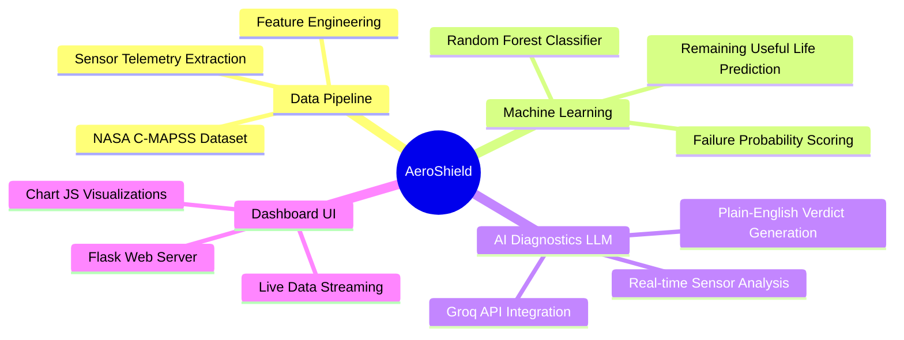

# AeroShield: Predictive Maintenance Dashboard

AeroShield is an AI-powered predictive maintenance dashboard designed for industrial machinery, specifically analyzing turbofan engines using the NASA C-MAPSS dataset. 

It provides real-time telemetry simulation, uses a Machine Learning model to calculate the probability of imminent engine failure, and integrates a Large Language Model (LLM) to act as an AI diagnostic assistant, providing human-readable verdicts based on the live sensor data.

## 🧠 Project Mind Map

Below is a visual representation of how the AeroShield system processes data from the raw dataset all the way to the user interface.



## 📂 Project Structure

Here is a breakdown of the core files in this repository and what they do:

- **`app.py`**: The main Flask backend server. It serves the web dashboard and provides the REST API endpoints that the frontend uses to fetch engine data and predictions.
- **`llm_verdict.py`**: Connects to the Groq API. It takes the live sensor readings and the Machine Learning model's probability score, and generates a plain-English diagnostic verdict.
- **`train_classifier.py`**: The script used to train the Random Forest Machine Learning model on the NASA dataset.
- **`feature_engineering.py`**: Handles cleaning and preparing the raw NASA dataset before it is fed into the Machine Learning model.
- **`static/`**: Contains the frontend logic (`app.js`) that handles the live simulation and charts, as well as the design system (`style.css`).
- **`templates/index.html`**: The main HTML structure for the dashboard.
- **`Dataset/`**: Contains the raw and test NASA C-MAPSS data files.
- **`Models/`**: Stores the pre-trained `rf_classifier.pkl` so the app doesn't have to retrain every time it starts.

## 🚀 How to Run Locally

If you want to run this project on your own machine:

1. **Clone the repository:**
   ```bash
   git clone https://github.com/menuka400/Predictive-Maintenance-for-Industrial-Machinery.git
   cd Predictive-Maintenance-for-Industrial-Machinery
   ```

2. **Install the required dependencies:**
   ```bash
   pip install -r requirements.txt
   ```

3. **Set up your AI API Key:**
   Create a `.env` file in the main folder and add your Groq API key:
   ```env
   GROQ_API_KEY=your_groq_api_key_here
   ```

4. **Start the Dashboard:**
   ```bash
   python app.py
   ```
   Finally, open `http://127.0.0.1:5000` in your web browser to view the live dashboard!
